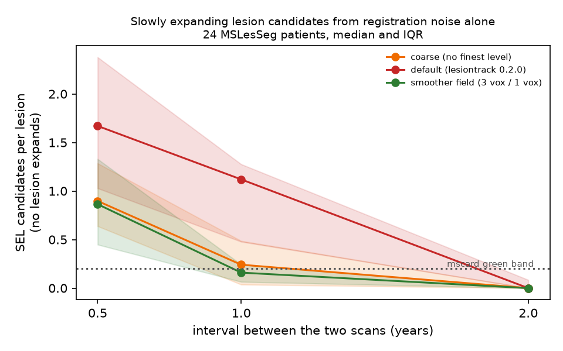
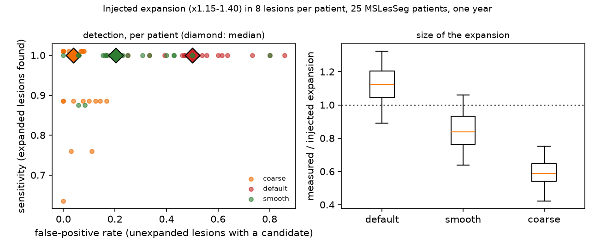

# The noise floor of slowly expanding lesion candidates

**Question.** How many slowly expanding lesion (SEL) candidates does the Elliott et al. 2019 rule mark when
no lesion expands?

**Method.** For each of 24 MSLesSeg patients, mscard's calibration builds a synthetic follow-up of the
baseline in which every lesion is unchanged apart from a 2 % whole-brain contraction, a rigid repositioning,
gain drift and noise. The pair is registered with lesiontrack's greedy pipeline under three settings:
default (lesiontrack 0.2.0), coarse (no finest-level iterations) and smooth (update and total field
smoothing of 3 and 1 voxels). The Jacobian is converted to percent per year for modelled intervals of 0.5,
1 and 2 years, since the registration does not depend on the interval, and SEL candidates are counted with
the Elliott rule: seeds of at least 12.5 %/yr growing into at least 4 %/yr, 10 voxels or more.
Script: `study/sel_noise_floor.py`; table: `study/sel_noise_floor.tsv`.

| Setting | 0.5 years | 1 year | 2 years |
|---|---:|---:|---:|
| default | 1.67 | 1.12 | 0.00 |
| coarse | 0.90 | 0.24 | 0.00 |
| smooth | 0.86 | 0.16 | 0.00 |

Median candidates per baseline lesion.

**Reading.**

* The rule's thresholds are rates. The same registration noise, divided by a shorter interval, becomes a
  faster apparent expansion. At six months, every setting marks about one candidate per lesion or more with
  nothing expanding; at two years, almost none.
* At one year the registration setting matters by a factor of seven: a smoother deformation field (0.16) against
  the default (1.12).
* A SEL count therefore means nothing without the interval and the registration settings, and a
  calibration like mscard's is the way to put a floor under it on each patient's own scan.

## Sensitivity at the same settings

The companion study (`study/sel_sensitivity.py`, table `study/sel_sensitivity.tsv`) injects known expansion into 8
lesions per patient (volume x1.15, 1.25 or 1.40 over one year, lesiontrack.synth) on 25 MSLesSeg patients with
enough lesions, and registers the pair under the same three settings.

| Setting | Sensitivity (median) | False-positive rate (median, IQR) | Measured / injected expansion |
|---|---:|---:|---:|
| default | 1.00 | 0.50 (0.36-0.58) | 1.12 |
| smooth | 1.00 | 0.20 (0.16-0.37) | 0.84 |
| coarse | 1.00 (IQR 0.88-1.00) | 0.04 (0.00-0.08) | 0.59 |

**Reading.** The smoother field keeps every expanding lesion detected and cuts the false-positive rate from 0.50
to 0.20, at the price of under-reading the size of the expansion by about a sixth. The coarse setting nearly removes
false positives but halves the measured expansion and starts to miss lesions. For counting SEL candidates the smooth
setting is the better default; for measuring how fast a lesion grows, the default setting is closer to the truth.
One registration cannot serve both, which is an argument for reporting SEL counts and expansion rates from
separately tuned runs, each with its calibration next to it.

**Limits.** One noise model (the synthetic rescan has no scanner change), one registration engine (greedy),
radially symmetric synthetic expansion, and one interval (one year) for the sensitivity study.
